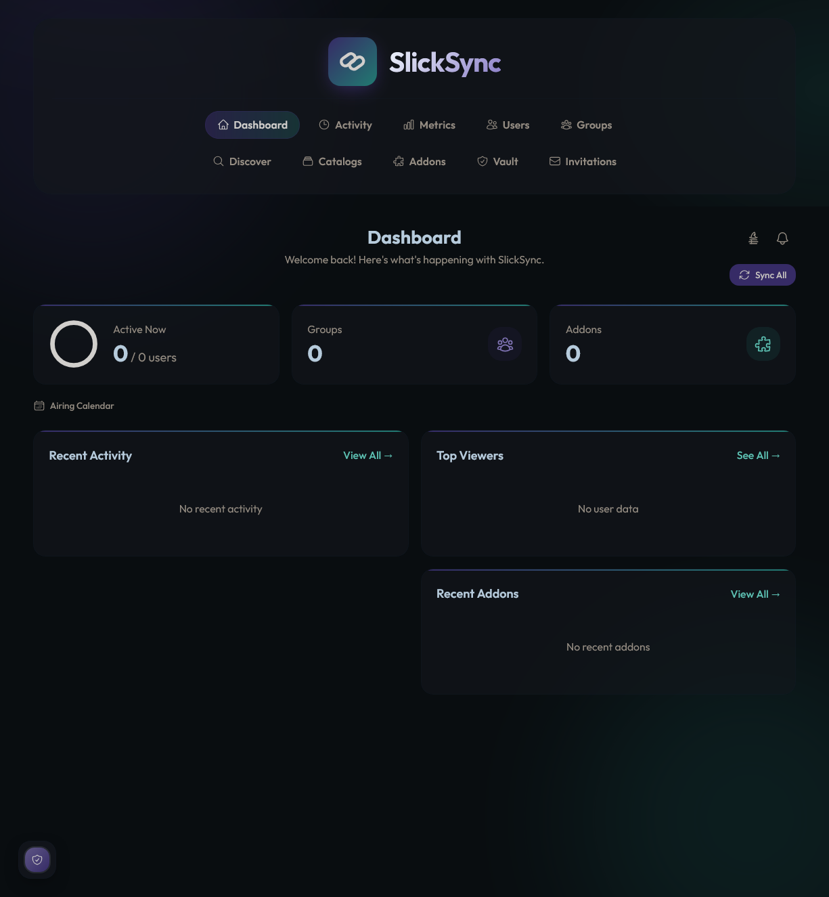
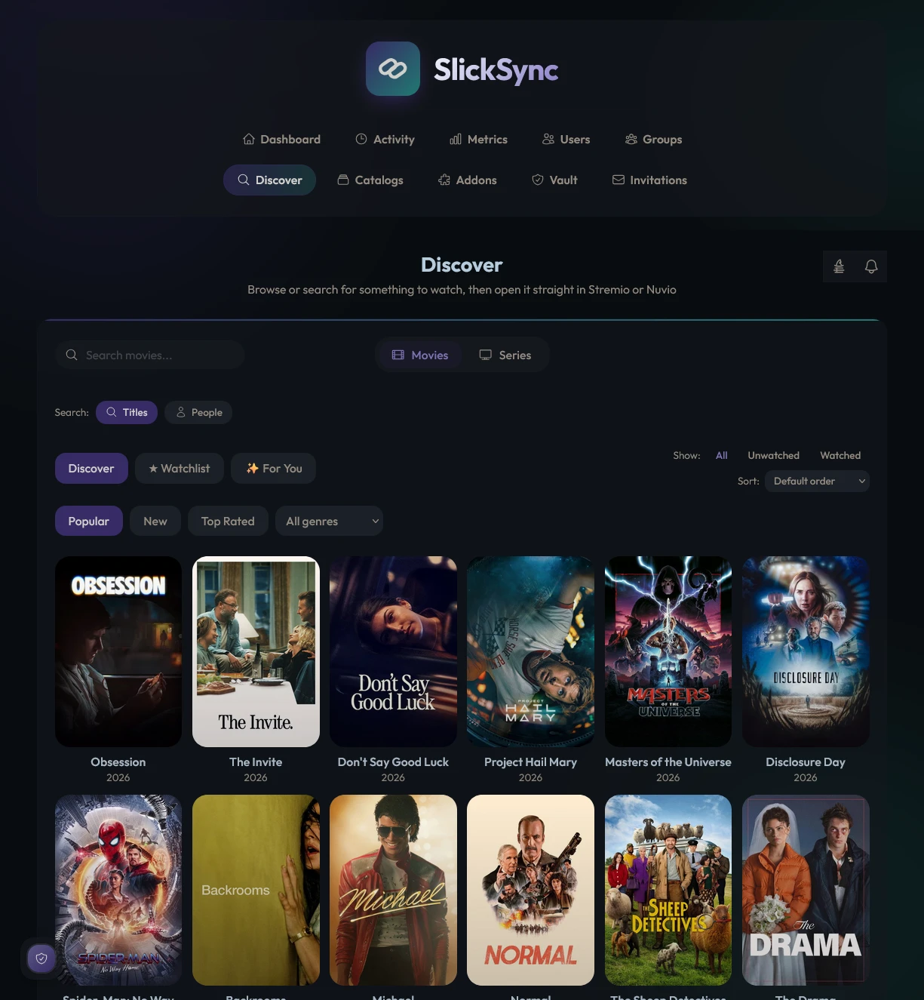
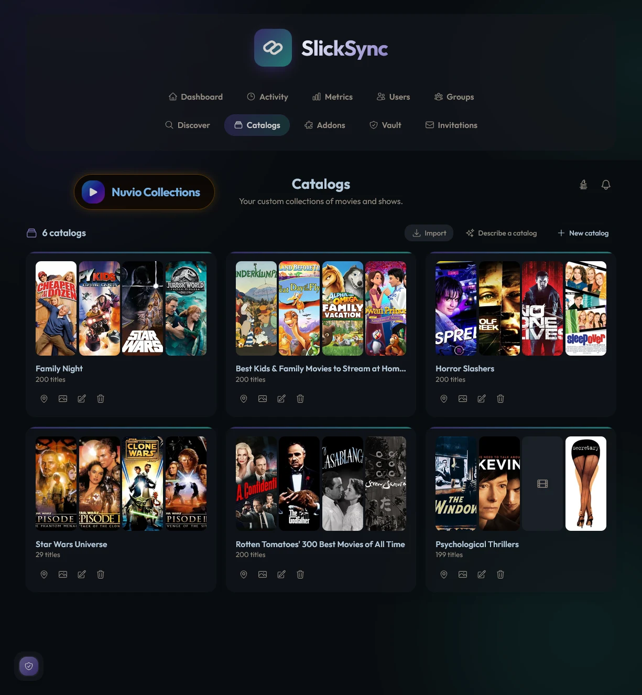
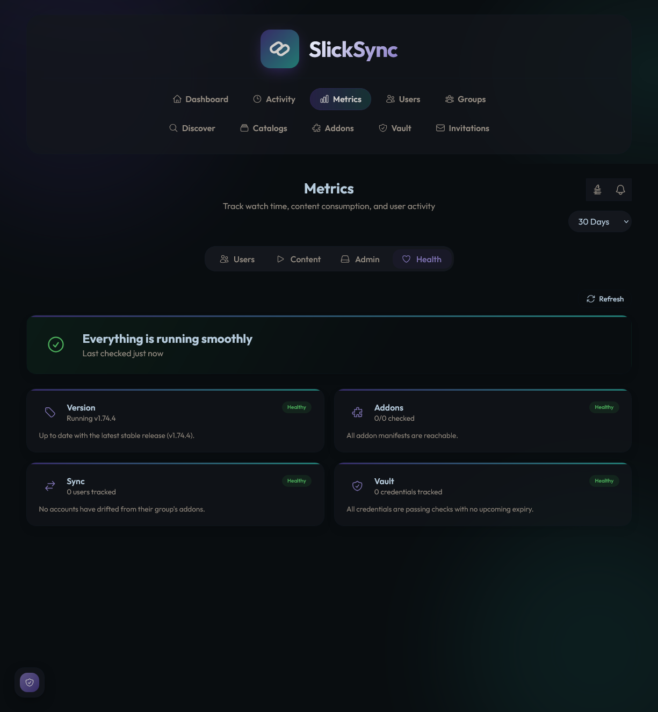

<div align="center">


# SlickSync

**One dashboard for a private streaming group.**

Addons, users, shared credentials, watch history and live playback —
kept in sync whether a member is on **Stremio** or **Nuvio**.

[](./LICENSE)
[](https://hub.docker.com/r/slicknsliding/slicksync)
[](https://bun.sh)
[](https://nextjs.org)

[**Install**](#installation) &nbsp;·&nbsp; [**Features**](#features) &nbsp;·&nbsp; [**Guides**](#new-here-start-with-the-guides) &nbsp;·&nbsp; [**Try it live**](https://slicksync.vip)

<br />



</div>

---

SlickSync manages a private streaming group's accounts from one place: groups, addon sets, shared credentials, watch history and live playback — kept in sync whether a member uses Stremio or Nuvio.

> **Private, single-instance fork.** Built and run for one household's streaming group, not a general-purpose multi-tenant product.
>
> Can't self-host? **[slicksync.vip](https://slicksync.vip)** runs the same code in public/multi-tenant mode, free to register — a courtesy option for anyone who wants SlickSync without running a server.

<sub>Built on [Syncio](https://github.com/iamneur0/syncio) · Vault inspired by [AIOManager](https://github.com/Sonicx161/AIOManager)</sub>

### New here? Start with the Guides

Once SlickSync is running, **`/guides`** is the fastest way to actually learn it — 74 topic pages covering every page and setting, organized by category and searchable, each with step-by-step instructions and the gotchas that actually come up. The same content also answers free-text questions straight from the **command palette** (`Ctrl+K`/`Cmd+K`) — no AI key required.

## Quick start

Docker and Docker Compose, plus a reverse proxy in front for HTTPS — SlickSync doesn't terminate TLS itself.

```bash
git clone https://github.com/slicknsliding/slicksync.git
cd slicksync
cp env.example .env
echo "JWT_SECRET=$(openssl rand -base64 32)" >> .env
docker compose -f docker-compose.private.yml up -d
```

Everything is served on `:3000`. `ENCRYPTION_KEY` generates itself on first boot — you only need to set `JWT_SECRET`. Full walkthrough, including the public/multi-tenant variant, in [Installation](#installation).

## What it does

| | |
|---|---|
| **[Multi-Provider Sync](#multi-provider-sync)** | Nuvio and Stremio as equals, not Stremio-plus-an-afterthought |
| **[Activity & Now Playing](#activity--now-playing)** | What's playing right now, and what's actually been watched |
| **[Discover & Media Details](#discover--media-details)** | Browse, get cast/ratings/trailers, and open straight into your app |
| **[Catalogs](#catalogs)** | Shareable lists with real import/export, not just a personal watchlist |
| **[Nuvio Collections](#nuvio-collections)** | Build a Nuvio account's home screen from SlickSync instead of hand-editing it |
| **[SlickTrax](#slicktrax)** | A built-in Trakt alternative — no external service, no tokens |
| **[Vault](#vault)** | Credential tracking with real expiry alerts and live provider checks |
| **[Notifications](#notifications)** | Push and the in-app bell are primary; Discord is optional |
| **[PWA & Push](#pwa--push)** | Installs like a native app, with per-device push |
| **[Addons](#addons)** | Drag-and-drop management with templates and protection |
| **[Automation](#automation)** | Rule-based actions on real events — no external workflow tool |
| **[Command Palette](#command-palette)** | Ctrl+K to jump anywhere, or ask a question and get a real answer |
| **[Themes](#themes)** | Ten themes, or build your own, shareable as a code |
| **[Metrics](#metrics)** | Leaderboards, streaks, taste profiles, and a Year in Review |
| **[System Health](#system-health)** | One page: is everything actually working right now |
| **[Backup & Disaster Recovery](#backup--disaster-recovery)** | Scheduled backups plus a full portable recovery kit |
| **[Security](#security)** | 2FA, OIDC/SSO, rate limiting, per-account keys |
| **[Installation](#installation)** | Docker Compose, one env file, behind your own reverse proxy |

<sub>Each section below expands with the full detail.</sub>

<table>
<tr>
<td width="50%"></td>
<td width="50%"></td>
</tr>
<tr>
<td align="center"><sub><b>Discover</b> — browse, then open straight into Stremio or Nuvio</sub></td>
<td align="center"><sub><b>Catalogs</b> — shareable collections, with real import/export</sub></td>
</tr>
<tr>
<td width="50%"></td>
<td width="50%" valign="middle"><sub>Plus <b>Metrics</b> with leaderboards, streaks and a Year in Review, <b>Vault</b> for credential expiry tracking, <b>Automation</b> for rule-based actions on real events, and a <b>command palette</b> that answers free-text questions from a built-in guide — no AI key required.</sub></td>
</tr>
<tr>
<td align="center"><sub><b>System Health</b> — whether everything is actually working, on one page</sub></td>
<td></td>
</tr>
</table>

## Features

### Multi-Provider Sync
Nuvio and Stremio as equals, not Stremio-plus-an-afterthought.

<details>
<summary>Show details</summary>

- Nuvio is a first-class provider alongside Stremio — not bolted on.
- OAuth device-code/QR or direct email+password to connect Nuvio.
- Every Nuvio profile syncs (not just the primary), library + progress + addons merged with a per-profile label.
- Same email can hold both a Stremio and a Nuvio user — auto-disambiguated by username → email → recent history → configured fallback.
- Nuvio refresh tokens encrypted at rest, auto-refreshing access tokens.
- Provider badge everywhere a user shows up — purple for Stremio, blue/orange split for Nuvio, fixed regardless of theme.
- Addon import fetches real manifest data for both providers, not just a bare URL+name.
- **Account merge** — absorb a second provider's identity into one existing user instead of managing them as two separate people, with a preview before merging and a full **Undo** afterward that restores both identities and their original watch history exactly.
- **Silent account-mismatch detection** — if a title is seen streaming but no connected account ever records it in History, that usually means playback happened on an account not yet added to SlickSync; a notification explains this and points at the fix.
- **SIMKL linking** — any user can optionally connect their own SIMKL account (PIN-based, no password ever touches SlickSync). Bidirectional: pulls SIMKL's own watch history in, and pushes SlickSync's already-unified record (every provider, every source) back out — the same value the removed Trakt integration had, without Trakt's one-connected-app free-tier limit that got it pulled.
</details>

### Activity & Now Playing
What's playing right now, and what's actually been watched.

<details>
<summary>Show details</summary>

- Live **Now Playing** panel, fed by a 30s poll of AIOStreams' proxy — real-time presence, gone the instant playback stops.
- **History & Watch Time** come from each provider's own library state (1-minute poll) — the permanent record, including sources the proxy can't see (usenet).
- **Real completion tracking** — finished vs. started-and-dropped, distinct from a raw "watched" flag, plus **rewatch counts** for movies watched again after a first finish.
- **Airing Calendar** — a date-grouped agenda of upcoming episodes for everything anyone's actively watching, with a "Coming Up" panel on the Dashboard.
- Correct-or-nothing posters: provider poster + Cinemeta-by-ID backfill for library items; strict exact-title Cinemeta match for proxy-detected items, never a guessed poster; optional **RPDB** integration for rating-embedded poster art if you have a (free) API key.
- Explicit per-account timezone for correct day-bucketing (Watch Time Today, streaks) — auto-detected from your browser the first time you open Settings, stored explicitly from then on so background jobs (which have no browser to ask) always know what "today" means.
- Dashboard/user-page widgets: Top Watched, Recent Activity, Top Viewers — built from real session duration.
- Cross-account library-sync dedup so a shared-login watch never double-counts.
</details>

### Discover & Media Details
Browse, get cast/ratings/trailers, and open straight into your app.

<details>
<summary>Show details</summary>

- Click any poster for cast, rating, genres, director, runtime, and awards (Cinemeta) — plus an inline YouTube trailer.
- Rotten Tomatoes/Metacritic ratings via an optional (free) OMDb key — like RPDB/MDBList/TMDb, your own key in Settings is used first, falling back to the instance's shared key only if you haven't set one.
- **Box office figures** (OMDb) and **"Part of the X Collection"** franchise grouping (TMDb) on the detail popup — the collection row is a collapsed-by-default disclosure with its own drag-to-scroll, same treatment as More Like This, so a long-running franchise doesn't dominate the popup by default.
- **Cast & crew deep-dive** — click any actor/director on a detail popup to see their real filmography (optional TMDb key) and jump straight into any of it.
- **Discover**: browse Popular / New / Top Rated, genre filter, infinite scroll, "Open in Stremio/Nuvio" on every result. Sort by title, year, or rating; filter to unwatched/watched only.
- **People search** — a separate mode from title search, so looking up an actor/director shows only their verified credits, never an unrelated title that happened to loosely match the name.
- Four sources side by side: Discover, ★ Watchlist, ✨ For You, and household "nobody's seen it yet" picks, plus an optional **SIMKL Trending** row for anyone with SIMKL linked.
- **Where to watch** — TMDb watch-provider logos and an **MDBList score** on the detail popup, alongside the existing IMDb/RT/Metacritic ratings.
- Deep links use each provider's real format (`stremio:///detail/...`, `nuvio://meta?...`) — no guessing, no account-specific data in the link.
- Continue Watching row on the Dashboard — drag to scroll, right-click/long-press to remove.
- Right-click (desktop) or long-press (mobile) any poster for a quick-action menu — Add to Watchlist, Add to Catalogs, Mark Watched — without opening the detail popup first.
- Rating badges on every poster card (IMDb/RT/Metacritic) are off by default — opt in from Settings if you want scores visible before opening a title.
</details>

### Catalogs
Shareable lists with real import/export, not just a personal watchlist.

<details>
<summary>Show details</summary>

Named collections of titles, separate from the Watchlist — build a "Halloween Marathon" or "Kids' Night" list and share the idea, not just watch it alone.

- Create, rename, delete; add titles from any poster's right-click menu or its detail popup, remove one via the same long-press/right-click menu on any item already in a catalog.
- **Watchlist/watched badges** and the same right-click quick-actions as Discover, right on every catalog's poster grid.
- **Custom cover art** — upload an image or pick a color, shown on the Catalogs index in place of the default poster collage.
- **Bulk select** and real drag-and-drop reordering for a catalog's items.
- **Import** an existing list straight from a **MDBList** or **TMDb** list URL (TMDb import is movies-only; MDBList supports both) — or go the other way and **export** a catalog to a brand-new MDBList list.
- **SIMKL**: import a linked user's SIMKL "Plan to Watch" as a new catalog, or export a catalog onto one — SIMKL doesn't expose named Custom Lists via its API yet, so this targets the closest real equivalent instead of doing nothing.
- **Refresh** an imported catalog against its original source URL any time, with a diff preview before applying, or opt a catalog into **daily auto-refresh** so it stays in sync with its source with no manual click.
- **Suggest Titles** — match a catalog's own name (e.g. "Halloween", "90s Movies", "30 Days of Halloween") against TMDb's real keyword taxonomy and release-date ranges, review a batch of matching posters, and add only what you keep. Requires a (free) TMDb key.
- **Build from a description** — type what you want ("90s horror movies", "cozy holiday films") and TMDb's keyword/genre/date-range matching generates a starter catalog for you to review and keep from, instead of adding titles one at a time.
- **Content Rating** — set a catalog to only ever show certain certifications (e.g. no R/NC-17); enforced continuously rather than applied once, so a re-imported or later-recertified title can't slip back in.
- Sort by title, year, or rating; each entry opens the same rich detail popup as everywhere else.
</details>

### Nuvio Collections
Build a Nuvio account's home screen from SlickSync instead of hand-editing it.

<details>
<summary>Show details</summary>

Organize a Nuvio account's own home-screen collections — the folders and catalog sources Nuvio itself shows a user — directly from SlickSync instead of hand-editing them in the Nuvio app.

- Build folders of catalog sources, drag to reorder folders and sources within them; grid or list view.
- Start from a template (Streaming Services, Genres) instead of building from scratch.
- **Cover art** for a collection and for each folder inside it individually — pick a URL/GIF or browse nuvio.tv's own public **Community Covers** gallery (with search and infinite scroll) directly from the picker; writes to the real field the Nuvio app itself reads, not just a SlickSync-side preview.
- **Broken-source detection** flags a folder whose catalog source no longer resolves (an addon removed, a catalog renamed) — and separately flags a folder with **zero sources attached**, since that saves and syncs fine but silently never renders on-device.
- **Genres template** builds one folder per genre from your account's own installed addons, skipping static/curated catalogs that only claim to support genre filtering (confirmed live: without this, unrelated genres could end up showing the exact same cover).
- **pin** any collection to the top of the Nuvio home screen.
- A folder's editor is split into Sources and Preview tabs — no scrolling one long panel to switch between adding sources and seeing the result.
- **Layout preview** — see exactly how a collection will lay out before saving.
- **Copy a whole collection between profiles** on the same account.
</details>

### SlickTrax
A built-in Trakt alternative — no external service, no tokens.

<details>
<summary>Show details</summary>

- **Watchlist** — bookmark from any poster.
- **Watched indicators** — real watch-history based, with a manual override.
- **For You recommendations** — up to 3 genre rows from real weighted watch time (recency-decayed), independently toggleable.
- **More Like This** on every detail popup, biased by real household affinity, always fresh/unwatched results.
- **✨ Real match** badge on any For You/More Like This row backed by genuine household viewing — reads differently at a glance from a pure genre-fallback guess.
- Optional **AI "why this matches"** one-line explanation on a real-match row, using your own OpenAI-compatible key (Settings → AI Services) — never required, every recommendation still works with it off.
- **Not Interested** feedback downweights similar titles, not just the one dismissed.
- **Trakt-compatible scrobble-in API** (`/api/scrobble`) — point a real Trakt-scrobbling client (Infuse, Kodi's Trakt plugin, etc.) at it with a per-user API key and it writes straight into SlickTrax history, no Trakt account involved.
- **Watch-history import/export** — import a Trakt/Letterboxd/IMDb CSV export into a user's history, or export SlickTrax history as a Letterboxd-compatible CSV.
</details>

### Vault
Credential tracking with real expiry alerts and live provider checks.

<details>
<summary>Show details</summary>

- AES-GCM encrypted at rest.
- Expiry/renewal alerts with configurable lead time, plus cost + billing-cycle spend tracking.
- Real active-checks: Real-Debrid/TorBox/Newznab against their own APIs, Stremio via real login, generic HTTP/TCP for the rest.
- Nightly encrypted export to `data/backup/vault/`, or on-demand.
- **Rotate Now** — one click opens both the entry's provider dashboard and its edit form together, instead of hunting down the dashboard URL yourself first.
- "Fix now" links straight from an alert to the entry, ready to edit.
- Drag-and-drop reordering; move addons between Addons and Vault without deleting them.
- **Live Real-Debrid/TorBox usage** on the entry card — active downloads and premium days remaining, pulled from the provider's own API.
- **Auto-remove** (opt-in, per entry) clears finished/idle Real-Debrid or TorBox torrents once they've sat past a day count you choose.
- **Renewal calendar & spend forecast** — a 90-day forward projection of every cost-tracked entry's own billing cycle, collapsed by default.
</details>

### Notifications
Push and the in-app bell are primary; Discord is optional.

<details>
<summary>Show details</summary>

**Push + the in-app bell are primary; Discord is entirely optional** — every notification type below works with zero Discord setup, and a webhook just adds Discord delivery on top for whichever types you want it for.

- Per-type toggles: activity, sync, invites, Vault, addon health, backups, **proxy connectivity**, and monthly recap.
- Instant "started watching" ping from the live proxy signal.
- **Unconfirmed-device alert** — a push+bell (and Discord, if set) notice when a stream shows up from an IP not yet seen on that account.
- Per-user notification opt-out and personal webhook override.
- New-episode alerts + a "Coming up" calendar on the Dashboard.
- **Monthly poster-mosaic recap**, posted automatically on the 1st — a real collage image to Discord if a webhook's set, otherwise a plain push+bell text summary ("14 titles watched this month").
- Addon down/back-up alerts from a background health check, and an alert if the AIOStreams proxy itself goes unreachable.
- **Digest mode** — batch everything above into one daily/weekly push+bell summary instead of a ping per event.
</details>

### PWA & Push
Installs like a native app, with per-device push.

<details>
<summary>Show details</summary>

- Installs like a native app — Home Screen on iOS/Android, desktop install on Chrome/Edge.
- Per-device push for every notification type once installed, zero setup — VAPID keys self-generate on first boot.
- Manage subscribed devices (rename, revoke) from Settings; a revoked device stops getting pushed to immediately, no re-install needed.
</details>

### Addons
Drag-and-drop management with templates and protection.

<details>
<summary>Show details</summary>

Drag-and-drop reordering, drag-to-protect or drag-to-label with color-coded custom tags, order-insensitive sync comparison, provider-agnostic live addon counts, and a template library (**Addon Snapshots**) to save/deploy a named addon set to any user.
</details>

### Automation
Rule-based actions on real events — no external workflow tool.

<details>
<summary>Show details</summary>

Rule-based actions that fire on real events, no external workflow tool needed — trigger on a new user being created or a daily schedule, and call an outgoing **webhook** as the action. Runs on the same engine that already drives notifications and health checks.
</details>

### Command Palette
Ctrl+K to jump anywhere, or ask a question and get a real answer.

<details>
<summary>Show details</summary>

**Ctrl+K** / **Cmd+K** from anywhere — jump straight to any page, user, addon, or catalog by typing a few letters, or ask a free-text question and get an answer from a built-in help guide covering every feature on this page. No AI key required; an **AI Services** key (Settings) only powers the optional extras noted above (For You explanations, addon-incident summaries) and is never needed for the palette itself.
</details>

### Themes
Ten themes, or build your own, shareable as a code.

<details>
<summary>Show details</summary>

Ten full themes, switchable live, synced across devices. Build your own on top of any base — accent colors, success/error overrides, corner-roundness, text scale, and a choice of 11 display fonts — with a live preview mockup. Two layout modes: the original sidebar, or **Nebula** (top nav + glass panels, default). **Share a theme** as a compact copy-paste code — no server round-trip, since themes are already client-side.
</details>

### Metrics
Leaderboards, streaks, taste profiles, and a Year in Review.

<details>
<summary>Show details</summary>

User leaderboard, watch streaks, watch-time trend, Top Viewers/Recent Activity/Recent Addons on the Dashboard, provider parity view, and a per-group activity dashboard.

- Same-email Stremio/Nuvio pairs are deduped in every leaderboard and total — one household member never counts as two.
- **Taste Profiles** — a per-user viewing fingerprint (favorite genres, habits) built from real watch history, not a guess.
- **Year in Review** — a Wrapped-style yearly recap: total watch time, top shows, most-rewatched titles, a by-month chart, and a per-user breakdown.
- **Public stats page** — an opt-in, unauthenticated share link (`/u/[slug]`) for a single user's own total watch time, top titles, and streak, off by default per user.
</details>

### System Health
One page: is everything actually working right now.

<details>
<summary>Show details</summary>

One page answering "is everything actually working right now" — Sync drift, addon reachability, Vault credential checks, and AIOStreams proxy connectivity, all read from state existing background monitors already maintain.

- **Ignore** a known, accepted failure (an addon you've intentionally left offline, an indexer that blocks your server's IP) to drop it out of Attention and its notifications — reversible any time from the same card.
- **Addon uptime %** over the last 7/30 days, reconstructed from the same health-check history the offline/online alerts already log.
- Optional **AI-generated incident summary** on an addon-down alert, using the same AI Services key as SlickTrax's "why this matches" — off unless you've set one.
- **Version card** — what's actually running, and whether a newer stable release has been published, without needing to check GitHub or `docker exec` in to find out.
</details>

### Backup & Disaster Recovery
Scheduled backups plus a full portable recovery kit.

<details>
<summary>Show details</summary>

Scheduled + on-demand config backups (validated for real restorability, not just valid JSON) and a separate **Disaster Recovery Kit** — the same export plus every Vault secret, re-encrypted under a passphrase you choose, fully portable to a brand-new instance.
</details>

### Security
2FA, OIDC/SSO, rate limiting, per-account keys.

<details>
<summary>Show details</summary>

Rate limiting actually enabled (including a separate per-account limit on public-mode API traffic), strict limits on credential/OAuth endpoints, correct `trust proxy` hop count, no hardcoded default key, and a self-generating anti-lockout encryption key with decrypt-only fallback on rotation. Every external API key (RPDB, MDBList, TMDb, OMDb) resolves an account's own Settings key first — a shared instance-wide key in `.env` is only ever a fallback for accounts that haven't set their own.

- **Two-factor authentication** — opt-in per account, authenticator-app QR setup, 10 one-time backup codes shown once at enable time. Disabling 2FA or regenerating backup codes both require a fresh code, not just an active session — a hijacked session alone can't turn your own second factor off.
- **OIDC/SSO login** — a "Continue with..." option for any OIDC-compliant provider (Authentik, Authelia, Keycloak, Google, etc.), configured once via env vars. Fully additive: password login keeps working, and 2FA (if enabled) still applies after an SSO sign-in.
- **Interactive API docs** (Swagger UI) at `/api/docs` for the external developer API (`/api/ext`) — try real requests with your own API key straight from the browser, generated from the same route handlers documented in [`API.md`](./API.md) so the two can't silently drift apart.
- Nuvio's self-service identity checks (view/delete) verify a real signed session token belonging to the caller, not just a client-supplied user id.
- **Self-service data export** — Settings → Privacy has a Download button exporting your own movie/episode watch history plus the household watchlist as JSON, no admin needed.
- **Self-service account deletion**, at two distinct scopes: an admin can wipe their entire account and everything tied to it (public multi-tenant mode), and separately, any managed user can delete just their own data (watch history, watchlist state, group membership) from their own User panel — without touching shared addons, groups, or anyone else's data — in both private and public instance mode.
</details>

---

## Installation

**Prerequisites**: Docker + Docker Compose, and a reverse proxy in front for HTTPS (Traefik/Caddy/nginx — SlickSync doesn't terminate TLS itself).

```bash
git clone https://github.com/slicknsliding/slicksync.git
cd slicksync
cp env.example .env
```

Generate a real secret and set it in `.env` — this is what signs your login sessions, so it needs actual randomness, not just a made-up phrase:
```bash
openssl rand -base64 32
```
```
JWT_SECRET=<paste the output above>
```
`ENCRYPTION_KEY` can stay unset — one generates itself on first boot (see Security above).

```bash
docker compose -f docker-compose.private.yml up -d
docker compose -f docker-compose.private.yml logs -f   # watch it come up
```
This pulls the pre-built `ghcr.io/slicknsliding/slicksync:private` image — the stable release built from `main`. (There's also a `:beta` image used for testing upcoming changes before they land on `main` — don't use it unless you specifically want to try something not yet released.) The same image is also published to Docker Hub as `slicknsliding/slicksync:private`, if you'd rather pull from there.

Frontend and API are both served through `:3000` — the frontend proxies `/api`, `/uploads`, and `/invite` requests to the API internally, so only `:3000` needs a port mapping or a reverse proxy pointed at it.

**Verify it's actually up**: `docker exec slicksync sh -c 'echo APP_VERSION=$APP_VERSION'` should print the current release tag (matching the latest on the [Releases page](https://github.com/slicknsliding/slicksync/releases)), and `https://your-domain/` should load the login page.

**Updating**: `docker compose -f docker-compose.private.yml pull && docker compose -f docker-compose.private.yml up -d` — your `/app/data` volume (database, encryption key, Vault backups, avatars) survives updates. No `git pull` or rebuild needed since the default config just pulls the published image. (If you switched to the commented-out `build:` block instead, use `git pull && docker compose -f docker-compose.private.yml up -d --build`.)

<details>
<summary><strong>Public / multi-tenant mode</strong> — hosting for more than one separate group</summary>

Private and public are genuinely different modes:

| | Private (default) | Public |
|---|---|---|
| Who it's for | One household running their own copy | Hosting for multiple separate groups |
| Database | SQLite, embedded | PostgreSQL (required) |
| Accounts | One shared instance, no signup | Self-registered, isolated per account |
| Image | Pre-built `ghcr.io/slicknsliding/slicksync:private` | Pre-built `ghcr.io/slicknsliding/slicksync:public` |

```bash
cp env.example .env
openssl rand -base64 32   # run twice - once for JWT_SECRET, once for ENCRYPTION_KEY
```
```
JWT_SECRET=<first generated value>
ENCRYPTION_KEY=<second generated value>
DATABASE_URL=postgresql://slicksync:slicksync@db:5432/slicksync
```
```bash
docker compose -f docker-compose.public.yml up -d
```
Pulls `ghcr.io/slicknsliding/slicksync:public` — same `main`-built release channel as private mode, not `:beta`. Also mirrored to Docker Hub as `slicknsliding/slicksync:public`.
First visit shows a "Create one" registration link. `/register` generates a random account UUID once — that UUID *is* the login ID, so save it; there's no recovery if it's lost.

A **Superadmin** panel (`/superadmin`) lets the operator search tenant accounts, bulk enable/disable/delete them, see a health summary with an abandoned-account flag, and review an **audit log** of every disable/enable/delete action taken — without ever exposing a tenant's own credentials or private data.

**Updating**: `docker compose -f docker-compose.public.yml pull && docker compose -f docker-compose.public.yml up -d`.
</details>

<details>
<summary><strong>Environment variables</strong></summary>

Everything beyond `JWT_SECRET`/`ENCRYPTION_KEY` has a sensible default — see `env.example` for the full list. Most likely to actually change:

| Variable | Purpose | Default |
|---|---|---|
| `NUVIO_SUPABASE_URL` / `NUVIO_SUPABASE_ANON_KEY` | Override Nuvio's backend endpoint | `https://api.nuvio.tv` / — |
| `SIMKL_CLIENT_ID` | Instance-wide SIMKL app registration (each account can also bring its own in Settings) | — |
| `OIDC_ISSUER` / `OIDC_CLIENT_ID` / `OIDC_CLIENT_SECRET` / `OIDC_REDIRECT_URI` | Enable "Continue with..." SSO login (all four required) — see `env.example` for the full set including scopes/display name/email allowlist | — |
| `AUTH_RATE_LIMIT_WINDOW_MS` / `AUTH_RATE_LIMIT_MAX_REQUESTS` | Credential-endpoint rate limit | 20 / 15 min |
| `POLL_RATE_LIMIT_MAX_REQUESTS` | OAuth device-flow poll limit | 60/min |
| `VAULT_BACKUP_INTERVAL_HOURS` | Vault export interval | 24 |
| `ACCOUNT_TIMEZONE` | Default day-bucketing timezone (overridable in Settings) | `America/Los_Angeles` |
| `AIOSTREAMS_URL` | Base URL of your AIOStreams instance | — |
| `AIOSTREAMS_AUTH_USERNAME` / `AIOSTREAMS_AUTH_PASSWORD` | Matching AIOStreams' own `AIOSTREAMS_AUTH` | — |
| `AIOSTREAMS_FALLBACK_USER_IDS` | Fallback user IDs for unresolvable proxy activity | — |
</details>

<details>
<summary><strong>Troubleshooting</strong></summary>

- **Decryption errors after an update** (`Unsupported state or unable to authenticate data`): the running code is deriving a different key than what encrypted your data — check `data/server_secret.key` wasn't lost, and don't modify `server/utils/encryption.js`'s key-derivation constants on a fork.
- **"credentials may be invalid" on Sync, but the same user's library/history still updates fine**: a decrypt-key rotation split your data across key generations — every read path falls back to the previous key automatically, but that leaves some secrets still encrypted under the old one. Boot logs show `[keyManager] ENCRYPTION_KEY differs from the previously persisted key` when this is the case. Fix it once and for all: `docker exec -it -e DATABASE_URL="file:///app/data/sqlite.db" <container> node scripts/consolidate-encryption-keys.js` (dry-run; add `--apply --sync-keyfile` to actually re-encrypt everything onto your current key and stop the warning from recurring).
- **"Detected additional lockfiles" during build**: delete any stray `package-lock.json` — this project runs on `bun`.
- **First-boot database errors**: confirm `/app/data` is writable by the container's user (`1001:1001`).
</details>

---

## Credits

- **[iamneur0](https://github.com/iamneur0)** — creator of [Syncio](https://github.com/iamneur0/syncio) (MIT), the engine SlickSync is built on.
- **[Avangelista](https://github.com/Avangelista)** — Nuvio provider integration concepts (OAuth device-code flow, credential auth).
- **[Sonicx161](https://github.com/Sonicx161/AIOManager)** — creator of AIOManager, direct inspiration for the Vault feature.

See [`README.upstream.md`](./README.upstream.md) for the original project's own README.

## License

MIT — see [`LICENSE`](./LICENSE). Original work © iamneur0 (Syncio); Nuvio integration concepts © Avangelista; Vault design inspiration © Sonicx161 (AIOManager); modifications © slicknsliding (SlickSync).
